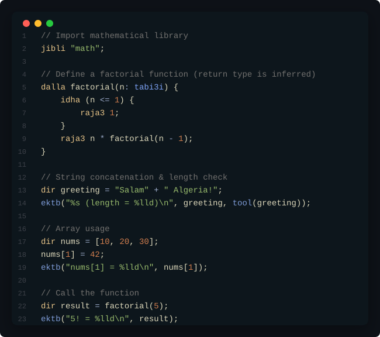

# Chkoupi-lang 🇩🇿

The **first** programming language with keywords in Algerian Darija, powered by LLVM.

> [!NOTE]
> **شكوبي | Chkoupi (Algerian Darija)**
>
> هي كلمة تعني العلقات البحرية التي تطفو على سطح البحر، يستعمل هذه الكلمة الصيادون حيث أنهم عندم يسأل أحد صياد أخر عن ما أصاد يجيب " صيدت الشكوبي" أي بمعنى لا شئ، و الكثير من الجزائريين يضنون أنها كلمة بذيئة و لكن ليست كذلك.
>
> _جاي كي الشكوبي، أي لا يصلح لأي شئ_
>
> ---
>
> **Translation:**
> *Chkoupi refers to marine algae/seaweed floating on the sea. Fishermen use it: when asked what they caught, they reply "Seyedt el chkoupi" ("I caught seaweed"), meaning "nothing at all". Although many Algerians mistake it for a vulgar term, it is not.*
>
> — Cited from [Mo3jam](https://en.mo3jam.com/term/%D8%B4%D9%D8%A9%D9%88%D8%A8%D9%8A)

---

## Try it Online

Write and run Chkoupi-lang code directly in your browser:

👉 **[train.brauh.tech](https://train.brauh.tech)**

---

## What is this?

Chkoupi-lang is a fully functional compiled language where keywords, types, and libraries are written in Algerian Darija. 

Instead of being an interpreted scripting language, it compiles directly to optimized machine code:
- **LLVM Backend**: Translates your source code into optimized native executables.
- **Type Coercion**: Automatically handles type conversions, such as promoting integers to floats.
- **First-Class Types**: Fat strings and heap-allocated dynamic arrays.
- **Modules**: Exposes a basic module resolution system (`jibli`).

---

## Reference Documentation

For detailed language specifications, syntax rules, and type behaviors, check the reference guide:

👉 **[DOCS.md](DOCS.md)**

---

## VS Code Editor Support

Chkoupi-lang has syntax highlighting and language configuration support for Visual Studio Code.

### One-Click Installation
1. Download `chkoupi-vscode-installer.exe` from the **[Releases](https://github.com/dzxpert/Chkoupi-lang/releases)** page.
2. Double-click/run the executable and press **Enter** to close it.
3. Restart or reload VS Code, and your `.dz` source files will highlight automatically!

*(The extension source files can also be viewed in the [editors/vscode/](editors/vscode) directory).*

---

## Simple Example



<details>
<summary>📋 Click to view copyable raw code</summary>

```dz
// Import mathematical library
jibli "math";

// Define a factorial function (return type is inferred)
dalla factorial(n: tabi3i) {
    idha (n <= 1) {
        raja3 1;
    }
    raja3 n * factorial(n - 1);
}

// String concatenation & length check
dir greeting = "Salam" + " Algeria!";
ektb("%s (length = %lld)\n", greeting, tool(greeting));

// Array usage
dir nums = [10, 20, 30];
nums[1] = 42;
ektb("nums[1] = %lld\n", nums[1]);

// Call the function
dir result = factorial(5);
ektb("5! = %lld\n", result);
```

</details>

---

## Quick Start

You can download a pre-built binary from the **[Releases](https://github.com/dzxpert/Chkoupi-lang/releases)** page, or compile it yourself.

### Building from Source
Prerequisites: A C++17 compiler, CMake 3.20+, and LLVM 17+.

```powershell
# Generate build configuration and compile (Windows Visual Studio 2022 example)
cmake -B build -G "Visual Studio 17 2022" -A x64 -DLLVM_DIR="D:/LLVM/lib/cmake/llvm"
cmake --build build --config Release
```

### Running the Compiler
```powershell
# Run immediately via LLVM JIT
chkoupi.exe myfile.dz

# Print raw LLVM IR
chkoupi.exe myfile.dz --emit-ir

# Compile to a native object file, then link
chkoupi.exe myfile.dz --emit-obj out.o
clang out.o -o myprogram
./myprogram
```